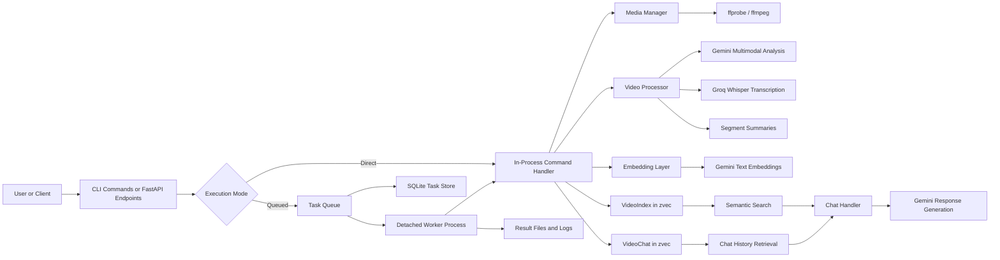

# Atlas Video: Functional and Architecture Overview

Atlas Video is a local-first multimodal video understanding system. At a functional level, it takes a raw video file, breaks it into time-based segments, extracts structured understanding from each segment, and turns those results into a searchable knowledge layer. A user can then interact with that layer in three primary ways: extract multimodal insights without persistence, index a video for later retrieval, or ask questions against previously indexed content through semantic search and chat. The system is designed for individual developers and small teams who want the capabilities of a multimodal retrieval system without standing up a distributed data pipeline or external vector database.

The product surface is intentionally simple. The main interface is a CLI with commands such as `extract`, `transcribe`, `index`, `search`, and `chat`. There is also a FastAPI server that exposes the same core operations as JSON or streaming HTTP endpoints. In practice, the CLI is the primary operating model and the server is a thin transport layer over the same backend logic. That keeps the architecture compact: Atlas does not have separate business logic for terminal and API use cases, and it avoids the maintenance burden that usually appears when CLI and service modes drift apart.

Functionally, the system separates transient analysis from persistent retrieval. `extract` runs the multimodal pipeline and returns segment-level results without storing them. `transcribe` runs a transcription-only path optimized around audio extraction and Whisper-based inference. `index` runs the full pipeline and then persists searchable representations into a local zvec-backed vector store. Once data is indexed, `search` performs semantic retrieval over video segments, and `chat` uses retrieved segment context plus prior conversation history to generate answers grounded in the indexed content. This makes Atlas behave like a compact retrieval-augmented generation system specialized for video.

## High-Level Architecture

The core processing pipeline starts with media ingestion. Atlas uses `ffprobe` to inspect the file and determine duration and stream characteristics, then uses `ffmpeg` to clip the media into overlapping chunks. Chunking is important because it converts a long-form video into smaller, parallelizable units that can be analyzed independently. That improves latency, makes failures more localized, and creates retrieval granularity that is useful at query time. For example, rather than embedding a single representation for a 30-minute video, Atlas embeds many short windows that better match user questions.

Each chunk is passed through the `VideoProcessor`, which orchestrates multimodal understanding. The processor can request multiple analysis attributes per segment, including visual cues, interactions, contextual information, audio analysis, and transcript text. Gemini is used for the multimodal description tasks, while Groq Whisper handles transcription. Atlas then optionally generates a short summary for each segment. The output of this stage is a structured result containing time boundaries, attribute-level analyses, and an aggregated transcript compiled in chronological order.

The retrieval layer is built on two local zvec collections. `VideoIndex` stores the indexed knowledge extracted from video segments. The design is notable because it stores both a segment-level document and per-attribute documents for the same time window. That means Atlas supports both broad semantic retrieval and more targeted retrieval over specific modalities. For example, a search for “people discussing AI ethics” may hit a full segment document, while a search focused on spoken content or audio cues can match a more granular attribute document. `VideoChat` stores user and assistant messages as an embedded conversation memory scoped to a specific video. This allows Atlas to combine fresh retrieval from the video corpus with lightweight semantic memory from previous turns.

On the query path, Atlas behaves like a specialized RAG system. A search request embeds the user query, runs a similarity search against the `VideoIndex` collection, and returns the most relevant time-bounded results. A chat request goes one step further: it retrieves relevant segment context from `VideoIndex`, recent chronological history from `VideoChat`, and semantically similar prior chat turns from the same collection. Those inputs are fused into a prompt sent to Gemini, and the model response is streamed back to the caller. After completion, both the user question and the assistant answer are embedded and persisted into `VideoChat`, so future turns can reference them.

Operationally, Atlas uses a pragmatic hybrid execution model. Commands can run directly in-process or be queued for background execution. The queue itself is intentionally lightweight: task metadata is stored in SQLite, results are written to local files, and each queued task runs in a detached Python worker process. That design avoids introducing Redis, Celery, or a message broker while still giving the user asynchronous processing, task status inspection, and crash isolation. The queue also enforces a simple concurrency policy: heavier commands like `extract` and `index` share a constrained slot, while transcription can run with slightly higher parallelism. For a local developer tool, that is a sensible tradeoff between throughput and machine stability.

From an architecture perspective, the strongest design choice is that Atlas is local by default. The only external services are model providers: Gemini for multimodal reasoning and embeddings, and Groq Whisper for transcription. Everything else, including vector search, chat memory, task state, and result storage, lives on disk under the user’s Atlas home directory. This reduces operational complexity and makes the system easy to run, inspect, and reason about. It also creates a clean mental model for a technical discussion: Atlas is essentially a packaged multimodal processing and retrieval engine, not a distributed platform.

The main tradeoff is that this simplicity puts more weight on careful local resource management. ffmpeg chunking, concurrent inference calls, zvec collection reuse, and detached worker processes all need to be coordinated to avoid lock contention or machine overload. The current codebase addresses that with bounded concurrency, lazy shared collection handles, and a clear split between processing, storage, and orchestration layers. That makes Atlas a good example of pragmatic architecture: it solves a real multimodal retrieval problem with a minimal set of moving parts, while still exposing enough structure to scale feature depth over time.
